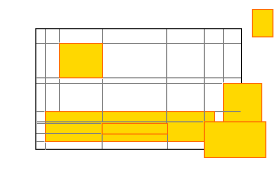
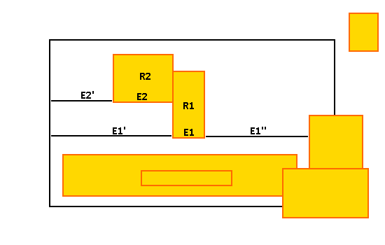
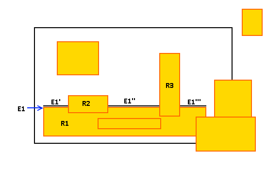
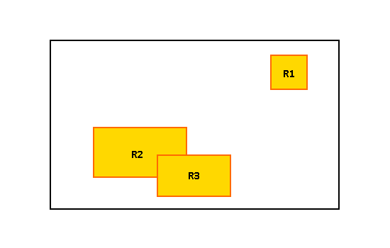
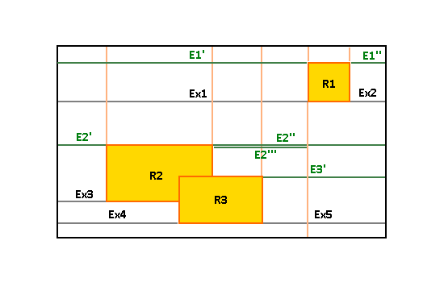

# Max Rectangle Algorithm Solution
I will describe three ways to solve this problem.

## My Assumptions:
For all the algorithms that are presented here I offer to do the following pre-processing actions:

1. Since we are interested and affected only by what happens inside the container, we will trim all the rectangles that are fully or partially located outside the container:

2. Personally I prefer working where the container always starts at (0,0). This is achieved simply by shifting the container and the rectangles in the X and Y axise and shifting back the result.

3. I will mark the container coordinates with (Xcl, Xcr, Yct, Ycb) where the first letter is the axis, the seconds is 'c' for container and the last one is the direction ('l'-left, 'r'-right, 't'-top, 'b'-bottom).

Note that actions 1 and 2 have O(n) complexity. 

## Solution 1: Grid-Based Brute Force 
### Overview
We will scan all the cells of the container and we will check for each cell what will be the biggest possible rectangle

### Description of Algorithm:
Divide the container into a cells of size 1x1
Mark the maximum rectangle as size 0
For each cell:
- For all the rows staring from the row of the current cell and ending in the last row of the container
- - Iterate from the cell X position to the container right edge
- - If encountered a rectangle or the edge check new max and store coordinates

### A More Mathematical Definition

```javascript
Divide the container into a cells of size 1x1. (This could simply achievied by using two-dimensional array)

mark max-rec as size 0
for each cell (Xi, Yj) of the container:

// Check that the current cell is not inside any other rectangle
If cell (Xi, Yj) is inside a rectangle, continue to the next cell

// For all the lines from the current cell to the edge of the container
for every line Yk from Yj to Ycb:
  // For every cell in the current row starting with the current cell x location
  mark max_length = MAX_INTEGER
  for every cell (Xm, Yk) from (Xi, Yk) to (Xcr, Yk)
  
  // Check that the next cell is not inside a rectangle
  If cell (Xm+1, Yk) is inside a rectangle OR (m-i < max_legth)
  
  // We reached a cell that is inside a rectangle; 
  // Check if we encountered a new rectangle
  if rectangle(Xi, Yj)-(Xm, Yk) > max-rec save it as max-rec
  mark max_length = m-i
  
The maximum rectangle is in max-rec
```

### Complexity
The complexity of this algorithm is _O((w*h)^2)_ where 'w' and 'h' are the width and height of the container.
This algorithm can be considered as acceptable solution where m << n and h << m

## Solution 2: Improved Brute Force
### Overview
We will build a 'smart' grid where we will extend all the edges of all the rectangles until they intersect with the container edges.
For each generated point we will find the maximum rectangle where the point is the upper-left coordinate

The following image illustrates the 'smart' grid (extended lines marked in gray)


### Description of Algorithm:
Build a vector of all the horizontal edges.
Build a vector of all the vertical edges.

For every horizontal edge build the extended edge and add all the intercepting vertical edges (create the 'virtual' points)

Go over all the horizontal edges and for each edge:
Add the two edge points to the list of points
build the extended edge (the 'l' will be 0 and the 'r' will be the containers' 'r')
add all intersecting points of the current extended edge with the previously processed edge to the list of points

For each point in the list of points find the largest possible rectangle the the next point is it's upper-left corner

### Complexity
The complexity of this algorithm is _O(N^4)_ Since for every point we scan maximum of O(N^2) other points

## Solution 3: The Optimized Solution
### Overview
This algorithm based on vertical swift of the lower edges of the rectangles until encountering a top edge or part of it.

We have two pre-processing actions:

_**Pre-Processing Action 1:**_ For all the horizontal lower edges calculate the extended edge (extend the edge on both directions of the x-axis until encountering a rectangle or the container edge).
In the following example we will extend edge E2 of rectangle R2 to the left (Extending by E2'). We will also extend E1 of R1 in both right and left directions by E1'' and E1' respectively.  (There are more edges to process on the example)



_**Pre-Processing Action 2:**_ For all the upper horizontal edges, break the edge to the visible parts of the edge
In the following example we will divide upper edge E1 of rectangle R1 to three edges E1', E1'', E1'''. (There are more edges to process on the example)



### Description of Algorithm:

* Build list of all horizontal edges
* Sort the horizontal edges list
* _Pre-Processing:_ Replace intersecting edges with only the visible part (As described in Pre-processing action 2)
* _Pre-Processing:_ Extend the lower facing edges as possible on the X axis (As described in Pre-processing action 1)
* Add the upper container edge to the beginning of the list
* Add the lower container edge to the end of the list

* While the horizontal edges list is not empty:
   * Take the first edge (Next most higher down-facing edge)
   * Scan the full edges list 
     * If the edge is down-facing, continue to the next edge
     * If the edge is the container bottom edge. Check if we got a bigger rectangle. If yes store it
     * If the edge is up-facing
         * Check if we got a bigger rectangle. If yes store it
         * Divide the down-facing edge with the up-facing edge and add all the remainders back to top of the list

### Sample Execution
The next example illustrates the algorithm:

Given the example below



The algorithm execution will be:



_Build list of all horizontal edges_
The horizontal list will be:

Edge | 
------
R1 top edge |
R1 bottom edge |
R2 top edge |
R3 top edge |
R2 bottom edge |
R3 bottom edge |


*_Replace intersecting edges with only the visible part (As described in Pre-processing action 2)_*

Edge | 
------
R1 top edge |
R1 bottom edge |
R2 top edge |
R3 top edge will be shortened to start from right of R2 |
R2 bottom edge will be shortened to end from left of R3|
R3 bottom edge |

*_Pre-Processing:_ Extend the lower facing edges as possible on the X axis (As described in Pre-processing action 1)_*

Edge |
------
R1 top edge |
R1 bottom edge that is extended by Ex1 and Ex2 |
R2 top edge |
R3 top edge will be shortened to start from right of R2 |
R2 bottom edge will be shortened to end from left of R3 extended by Ex3||
R3 bottom edge extended by Ex4 and Ex5|

*_Add the upper container edge to the beginning of the list_*

*_Add the lower container edge to the end of the list_*

The final vertical edges list after pre-processing will look like:


Edge | Type|
-----|------|
Container top edge |  Bottom |
R1 top edge | Top |
R1 bottom edge that is extended by Ex1 and Ex2 | Bottom |
R2 top edge | Top |
R3 top edge will be shortened to start from right of R2 | Top |
R2 bottom edge will be shortened to end from left of R3 extended by Ex3| Bottom |
R3 bottom edge extended by Ex4 and Ex5| Bottom |
Container bottom edge | Top |


The algorithm will execute the following steps:
max_rect = 0;
while vertical edges list is not empty
* Take out top edge (This is the first one -- the top container edge)
* Next edge is R1 top edge.
  * Calculate (Xcr-Xcl)x(R1t) and store if it is bigger than previous max_rect
  * Break top edge to three edges and insert E1' and E1'' back to the list
* Next iteration: Take out E1'
* Next up-facing edge is R2 top edge.
  * Calculate (E1'r-E1'l)x(R2t) and store if it is bigger than previous max_rect
  * Break E1' edge to three edges and insert E2' and E2''' back to the list

...And so on

### Complexity
The pre processing is _O(n*log(n))_
The algorithm traversal is _O(N^2)_  -- In each step we scan the vertical edges list. (worst O(N)) and we do it for all vertical edges.

O(Algorithm) = _O(n*log(n))_ + _O(N^2)_ = _O(N^2)_

### Thinking Further
I Think that the complexity can be further reduced to O(N*log(N)) by building a search tree for the next and previous intersecting edge. And by building a range-search tree. The rest of the algorithm will remain the same.

**Note: This algorithm can be implied in any direction of scanning with minor adjustments.
